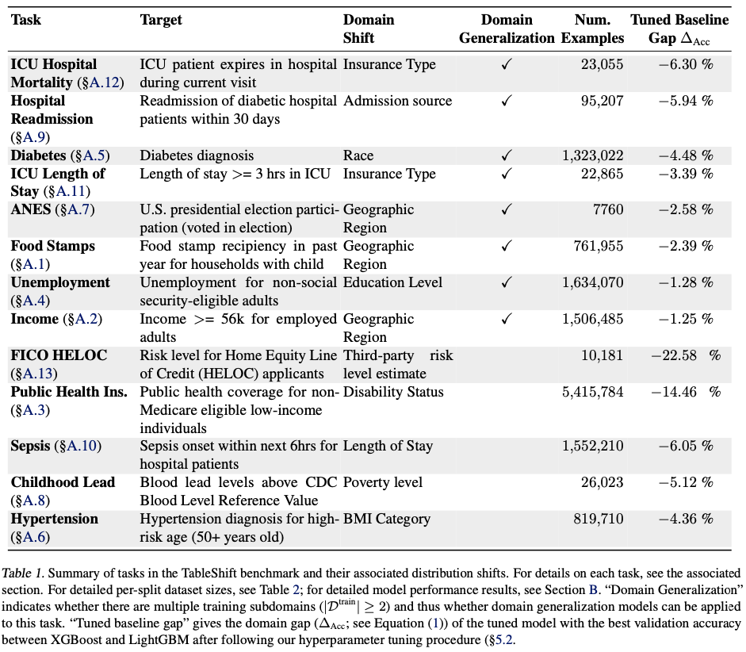

# TableShift

TableShift is a benchmarking library for machine learning with tabular data. The
package is under active development. If you find an issue, please file a GitHub
issue in the project repo.

This is an alpha version of TableShift, so the API is **not** guaranteed to
remain stable (even though we hope it does!).

# Quickstart

**Environment setup:** We recommend the use of conda with TableShift. To create
a conda environment, simply clone this repo, enter the root directory, and run

``` 
conda env create -f environment.yml
```

Then the tableshift environment can be activated
with `conda activate tableshift`.

**Accessing datasets:** If you simply want to load and use a standard version of
one of the TableShift datasets, it's as simple as this:

``` 
from tableshift import get_dataset
dset = get_dataset(experiment, cache_dir)
```

The full list of TableShift IDs for all available datasets is below.

If you would like to use a dataset *without* a domain split, replace `get_dataset()` with `get_iid_dataset()`.

The call to `get_dataset()` returns a `TabularDataset` that you can use to
easily load tabular data in several formats, including Pandas DataFrame and
PyTorch DataLoaders:

``` 
# Fetch a pandas DataFrame of the training set
X_tr, y_tr, _, _ = dset.get_pandas("train")

# Fetch and use a pytorch DataLoader
train_loader = dset.get_dataloader("train", batch_size=1024)

for X, y, _, _ in train_loader:
    ...
```

For all TableShift datasets, the following splits are available: `train`, `validation`, `id_test`, `ood_validation`, `ood_test`.

For IID datasets (those without a domain split) these splits are available: `train`, `validation`, `test`.

There is a complete example of a training script in `examples/run_expt.py`.

# Dataset Availability

*tl;dr: if you want to get started exploring ASAP, use datasets marked as "
public" below.*

All of the datasets used in TableShift are publicly accessible and open-source.
However, some datasets do require signing a data use agreement; as a result,
some datasets must be manually fetched and stored on your local machine.

A list of datasets, their names in TableShift, and the corresponding access
levels are below. The Tableshift ID is the value that should be passed as the `experiment` parameter to `get_dataset()`.

| Dataset                                 | TableShift ID             | Availability                                                                                                                   |
|-----------------------------------------|---------------------------|--------------------------------------------------------------------------------------------------------------------------------|
| Income (ACS)                            | `acsincome`               | Public                                                                                                                         |
| Food Stamps (ACS)                       | `acsfoodstamps`           | Public                                                                                                                         |
| Public Coverage (ACS)                   | `acspubcov`               | Public                                                                                                                         |
| Unemployment (ACS)                      | `acsunemployment`         | Public                                                                                                                         |
| Diabetes (BRFSS)                        | `brfss_diabetes`          | Public                                                                                                                         |
| Hypertension (BRFSS)                    | `brfss_blood_pressure`    | Public                                                                                                                         |
| Communities and Crime                   | `communities_and_crime`   | Public                                                                                                                         |
| COMPAS                                  | `compas`                  | Public                                                                                                                         |
| Hospital Readmission                    | `diabetes_readmission`    | Public                                                                                                                         |
| German Credit                           | `german`                  | Public                                                                                                                         |
| Cholesterol (NHANES)                    | `nhanes_cholesterol`      | Public                                                                                                                         |
| Childhood Lead (NHANES)                 | `nhanes_lead`             | Public                                                                                                                         |
| PhysioNet                               | `physionet`               | Public                                                                                                                         |
| ANES                                    | `anes`                    | Data Use Agreement ([source](https://electionstudies.org))                                                                     |
| HELOC                                   | `heloc`                   | Data Use Agreement ([source](https://community.fico.com/s/explainable-machine-learning-challenge)                              |
| Hospital Length-of-Stay (MIMIC-Extract) | `mimic_extract_los_3`     | Data Use Agreement ([source](https://github.com/MLforHealth/MIMIC_Extract))                                                    |
| Hospital Mortality (MIMIC-Extract)      | `mimic_extract_mort_hosp` | Data Use Agreement ([source](https://github.com/MLforHealth/MIMIC_Extract))                                                    |
| MOOC                                    | `mooc`                    | Data Use Agreement ([source](https://dataverse.harvard.edu/file.xhtml?persistentId=doi:10.7910/DVN/26147/FD5IES&version=11.2)) |

Note that details on the data source, which files to load, and the feature
codings are provided in the TableShift source code for each dataset and data
source (see `data_sources.py` and the `tableshift.datasets` module).

# Dataset Details

More information about the tasks, datasets, splitting variables, data sources, and motivation are available in the TableShift paper; we provide a summary excerpted from the paper below.



# Example Training Script and Code

A sample training script is located at `examples/run_expt.py`. However, training a scikit-learn model is as simple as:

``` 
from tableshift import get_dataset
from sklearn.ensemble import GradientBoostingClassifier

dset = get_dataset("diabetes_readmission")
X_train, y_train, _, _ = dset.get_pandas("train")

# Train
estimator = GradientBoostingClassifier()
trained_estimator = estimator.fit(X_train, y_train)

# Test
for split in ('id_test', 'ood_test'):
    X, y, _, _ = dset.get_pandas(split)
    preds = estimator.predict(X)
    acc = (preds == y).mean()
    print(f'accuracy on split {split} is: {acc:.3f}')
```

The code should output the following:

```  
accuracy on split id_test is: 0.655
accuracy on split ood_test is: 0.619
```

Now, please close that domain gap!
